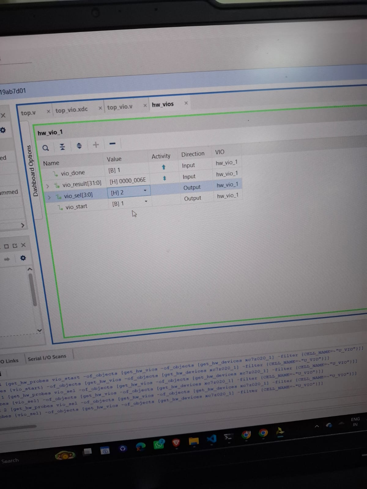

# systolic_array

A systolic array accelerator project (processing element → array → control → top-level integration),
built and verified in Verilog, targeted at Vivado for synthesis/implementation, with a Python golden
model for verification and (eventually) MNIST inference.

## Layout

```
rtl/          Verilog source: pe.v, array.v, controller.v, loader.v,
              uart_rx.v, uart_tx.v, top.v (UART), top_vio.v (JTAG/VIO bring-up)
tb/           Testbenches: tb_pe.v, tb_array.v, tb_ctrl_array.v,
              tb_uart_loop.v, tb_system.v
sim/          Test vectors (per-case dirs under sim/vectors/)
python/       Golden model, vector generator, diff_trace.py debug tool, host.py
constraints/  XDC pin/timing constraints (top.xdc, top_vio.xdc) for the ZedBoard
vivado/       Vivado project (auto-generated, gitignored)
docs/         Notes, block diagrams, screenshots for the report
```

## Build / simulate

- RTL and testbenches live under `rtl/` and `tb/`; test vectors consumed by the testbenches live under `sim/vectors/`.
- The Python golden model under `python/` generates the vectors in `sim/vectors/` and `diff_trace.py` can
  localize the first cycle/PE where an RTL sim trace diverges from the golden one.
- The Vivado project under `vivado/` is regenerated locally (not tracked in git) — open/create it there,
  point it at `rtl/`, `tb/`, and the matching XDC in `constraints/`, for synthesis, implementation, and waveform viewing.

## Status

**T0 complete, in simulation and on ZedBoard silicon.**

- **Simulation:** full datapath (PE → array → controller) plus UART rx/tx, loader, saturating readout,
  and top-level integration. End-to-end simulation (`tb_system.v`) passes bytes-in → correct-bytes-out on the
  counting/random/extremes vector cases, overflow LED included.
- **On board (xc7z020clg484-1):** `top_vio.v` runs a hardcoded "counting" matmul (C = A·Aᵀ) on the array,
  driven and read back over JTAG through a Vivado VIO core (no UART, no PS). BTNC (active-high) is inverted
  internally to the active-low `rst_n`: released = run, pressed = reset.

  In the capture below, `vio_sel = 2` selects C[0][2] and `vio_result = 0x6E = 110`, which matches the
  golden value (1·9 + 2·10 + 3·11 + 4·12), with `vio_done = 1`.

  

Tags: `t0-datapath`, `t0-system`, `t0-onboard`.
