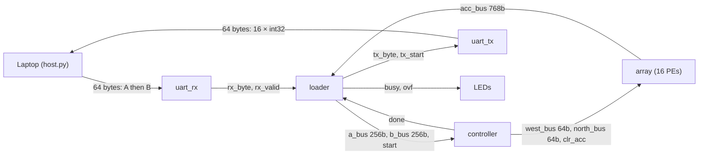
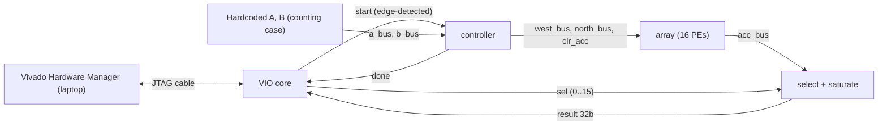
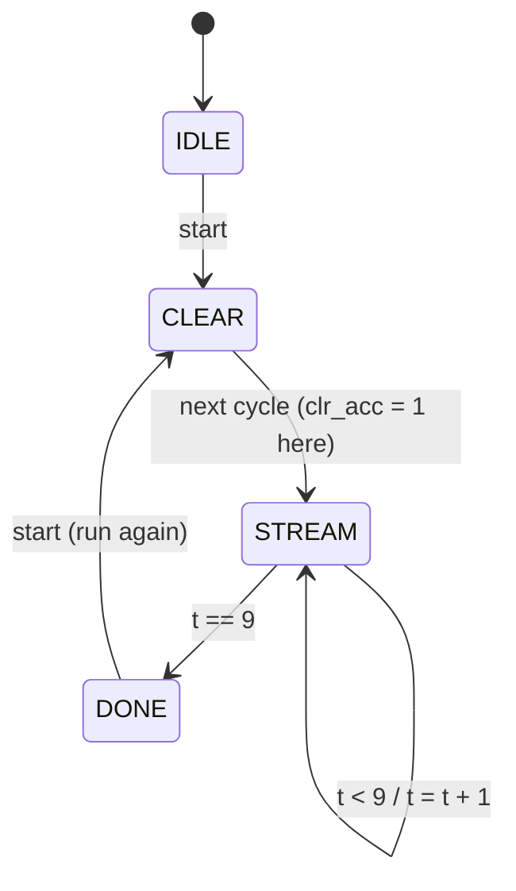
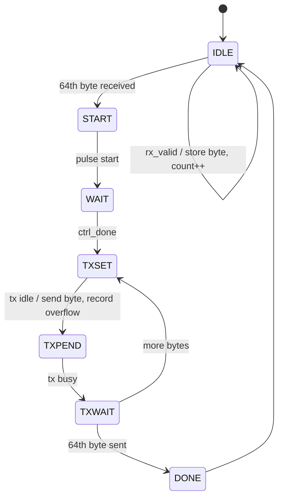
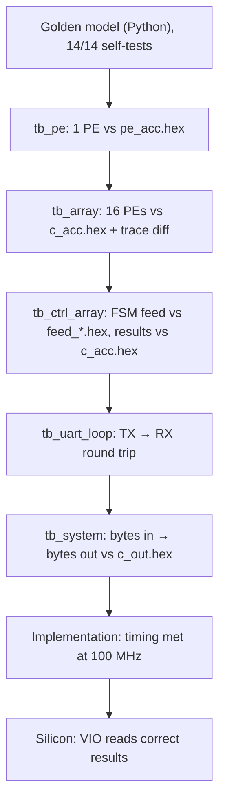
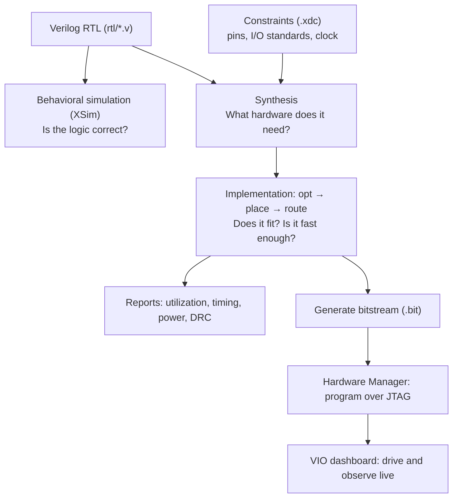

# T0 Complete Guide
## A 4×4 Systolic Matrix Multiplier on the ZedBoard, from Arithmetic to Silicon

**Project:** Precision-scalable systolic matrix multiplier (Reconfigurable Computing, CS G553, BITS Hyderabad)
**Board:** ZedBoard, Zynq-7000 `xc7z020clg484-1` · **Tools:** Vivado 2022.2, Python 3 + NumPy, Icarus/XSim
**Repo:** https://github.com/Karthik-Flash/systolic_array
**Status:** T0 complete. Verified in simulation, implemented at 100 MHz, and computing correctly on physical silicon.

---

## Contents

1. [The result in one page](#1-the-result-in-one-page)
2. [Numbers inside a chip](#2-numbers-inside-a-chip)
3. [The multiply-accumulate (MAC)](#3-the-multiply-accumulate-mac)
4. [Matrices and matrix multiplication](#4-matrices-and-matrix-multiplication)
5. [Why special hardware: the memory wall](#5-why-special-hardware-the-memory-wall)
6. [Systolic arrays in depth](#6-systolic-arrays-in-depth)
7. [The skew algorithm: why data enters as a staircase](#7-the-skew-algorithm-why-data-enters-as-a-staircase)
8. [A complete 2×2 walkthrough, tick by tick](#8-a-complete-22-walkthrough-tick-by-tick)
9. [Architecture of T0](#9-architecture-of-t0)
10. [Module by module, with code](#10-module-by-module-with-code)
11. [Verification: how we know it's right](#11-verification-how-we-know-its-right)
12. [FPGAs and the Vivado flow](#12-fpgas-and-the-vivado-flow)
13. [Reading the reports](#13-reading-the-reports)
14. [Bringing it up on the board](#14-bringing-it-up-on-the-board)
15. [Bugs we caught, and what each taught](#15-bugs-we-caught-and-what-each-taught)
16. [The important files](#16-the-important-files)
17. [Glossary](#17-glossary)
18. [What comes next](#18-what-comes-next)

---

## 1. The result in one page

We built a small piece of custom hardware that multiplies two 4×4 matrices of 16-bit integers. It uses 16 multiply-accumulate units arranged in a grid, all working at once, every clock tick. It was designed from scratch and checked against a Python reference at every step. It was then laid out on a real FPGA, meets timing at 100 MHz, and on the ZedBoard it returns correct answers that we read live from a laptop.

| What | Result |
|---|---|
| Architecture | 4×4 output-stationary systolic array |
| Arithmetic | int16 inputs, 48-bit accumulators, 32-bit saturated outputs |
| Multiplier blocks | **16 DSP48E1** (exactly one per processing element) |
| Logic | 1,335 LUTs, 665 flip-flops, 0 block RAM (full UART system) |
| Clock | **100 MHz, timing met** (worst setup slack +0.378 ns, UART system; +1.427 ns, VIO system) |
| Compute latency | 10 streaming cycles + 1 clear cycle = **110 ns** per 4×4 multiply |
| Peak throughput | 16 MACs/cycle × 100 MHz = **1.6 GMAC/s** (3.2 GOPS) |
| On silicon | VIO readout `sel=2 → 0x0000006E = 110`, exactly `C[0][2]` |
| Power (UART build) | 0.117 W total on-chip, 0.011 W dynamic |

---

## 2. Numbers inside a chip

### 2.1 Bits and binary

A chip stores everything in switches that are either off (0) or on (1). One switch is a **bit**. A row of bits is read like a number in base 2, where each position is worth twice the one to its right:

```
  bit position:   7    6    5    4    3    2    1    0
  weight:       128   64   32   16    8    4    2    1

  0 0 0 1 1 1 1 0  =  16 + 8 + 4 + 2  =  30   (hex 0x1E)
```

Engineers write long binary numbers in **hexadecimal** (base 16, digits 0–9 then a–f), because each hex digit is exactly four bits. `0x1E` is `0001 1110` is 30. You will see `1e` all over this project, because 30 is our favourite test answer.

### 2.2 Negative numbers: two's complement

To store negatives, hardware uses **two's complement**: the top bit carries a negative weight. For 16 bits, the top bit is worth −32,768 instead of +32,768.

```
  16-bit signed range:   -32,768  ...  +32,767

  0x7FFF = 0111 1111 1111 1111 = +32,767   (largest)
  0x8000 = 1000 0000 0000 0000 = -32,768   (most negative)
  0xFFFF = 1111 1111 1111 1111 = -1
```

**Sign extension** is how you widen a signed number without changing its value: copy the top bit into the new upper bits. The 16-bit −1 (`0xFFFF`) becomes the 32-bit −1 (`0xFFFFFFFF`), not `0x0000FFFF` (which would be +65,535). Getting this wrong was a real bug in this project (Section 15).

### 2.3 Precision: int16, int8, int4

"Precision" means how many bits each number gets:

| Type | Bits | Range | Distinct values | Analogy |
|---|---|---|---|---|
| int16 | 16 | −32,768 … +32,767 | 65,536 | photo in 65,536 shades |
| int8 | 8 | −128 … +127 | 256 | photo in 256 shades |
| int4 | 4 | −8 … +7 | 16 | photo in 16 shades |

Fewer bits means smaller, faster, lower-power hardware, but coarser numbers. Neural networks often tolerate int8 or even int4 with little accuracy loss, which is why AI chips care about this. T0 builds the int16 baseline. Switching precision at runtime is the job of T1–T3.

### 2.4 Overflow and saturation

Every register has a fixed width. If a result is too big to fit, hardware **wraps around** by default: a large positive number turns silently into a negative one, like an odometer rolling over. The fix is **saturation**: clamp to the largest (or smallest) representable value and raise a flag.

```
  wrap-around (bad):   2,147,483,647 + 1  ->  -2,147,483,648
  saturation (good):   2,147,483,647 + 1  ->   2,147,483,647   + overflow flag
```

Our output stage saturates every 48-bit result to 32 bits and lights an LED if any result was clamped.

---

## 3. The multiply-accumulate (MAC)

Nearly all heavy numerical work reduces to one operation repeated billions of times:

> **Multiply two numbers, and add the product to a running total.**

That is a **multiply-accumulate (MAC)**. The running total lives in an **accumulator**.

```
  acc = 0
  acc = acc + 2*3    ->  6
  acc = acc + 4*5    ->  26
  acc = acc + 1*7    ->  33
```

A sum of products like `2·3 + 4·5 + 1·7` is called a **dot product** of the vectors `[2,4,1]` and `[3,5,7]`. Our whole chip exists to compute many dot products in parallel.

In hardware, one MAC per clock tick looks like this:

```
        a ──┐
            ├──►[ × ]──► product ──►[ + ]──►[ acc register ]──┐
        b ──┘                        ▲                        │
                                     └────────────────────────┘
                                         (feedback: old total)
```

---

## 4. Matrices and matrix multiplication

### 4.1 What a matrix is

A **matrix** is a rectangular grid of numbers. `A[i][j]` means the entry in row `i`, column `j` (we count from 0).

```
          col0 col1 col2 col3
  row0  [   1    2    3    4 ]
  row1  [   5    6    7    8 ]      A[1][2] = 7
  row2  [   9   10   11   12 ]
  row3  [  13   14   15   16 ]
```

Matrices matter because rotating 3-D graphics, solving physics, compressing images, and running every layer of a neural network all come down to multiplying matrices.

### 4.2 The rule

To compute `C = A × B`, each output entry is the dot product of one **row of A** with one **column of B**:

```
  C[i][j] = A[i][0]·B[0][j] + A[i][1]·B[1][j] + ... + A[i][K-1]·B[K-1][j]

          = Σ (k = 0 .. K-1)  A[i][k] · B[k][j]
```

Picture it as a row sliding across a column:

```
      A (row i)              B (column j)
  [ a0  a1  a2  a3 ]   ·    [ b0 ]
                            [ b1 ]      =  a0·b0 + a1·b1 + a2·b2 + a3·b3  =  C[i][j]
                            [ b2 ]
                            [ b3 ]
```

### 4.3 The textbook algorithm

```python
def matmul(A, B, N, K):
    C = [[0]*N for _ in range(N)]
    for i in range(N):            # each output row
        for j in range(N):        # each output column
            acc = 0
            for k in range(K):    # the dot product
                acc += A[i][k] * B[k][j]      # one MAC
            C[i][j] = acc
    return C
```

For N×N matrices this is **N³ MACs**. Our 4×4 case is 4 × 4 × 4 = **64 MACs**. A 1024×1024 multiply is about a billion. A CPU runs these loops largely one MAC at a time; our hardware runs 16 at once.

### 4.4 Our favourite test case: "counting"

Throughout the project we use `A[i][j] = 4i + j + 1` and `B = Aᵀ` (A transposed, rows become columns):

```
  A = [  1  2  3  4 ]        B = Aᵀ = [ 1  5   9  13 ]
      [  5  6  7  8 ]                 [ 2  6  10  14 ]
      [  9 10 11 12 ]                 [ 3  7  11  15 ]
      [ 13 14 15 16 ]                 [ 4  8  12  16 ]

  C = A × B = [  30   70  110  150 ]
              [  70  174  278  382 ]
              [ 110  278  446  614 ]
              [ 150  382  614  846 ]
```

You can check corners by hand: `C[0][0] = 1²+2²+3²+4² = 30` and `C[3][3] = 13²+14²+15²+16² = 846`. Flattened row-major, the 16 results are:

```
  index:   0   1    2    3   4    5    6    7    8    9   10   11   12   13   14   15
  value:  30  70  110  150  70  174  278  382  110  278  446  614  150  382  614  846
```

On the board, VIO showed index 2 = `0x6E` = 110. That is this table, computed by silicon.

---

## 5. Why special hardware: the memory wall

The multiply itself is cheap. **Moving data is expensive.** Fetching a number from off-chip memory costs far more time and energy than multiplying it. This is called the **memory wall**.

```
  CPU style (fetch everything, every time)

     RAM ──► A[i][k] ──┐
     RAM ──► B[k][j] ──┼──► [MAC] ──► RAM
                       │
     repeat N³ times: 2 fetches per MAC

  Systolic style (fetch once, reuse many times)

     RAM ──► A row ──► PE ──► PE ──► PE ──► PE      each A value used by N PEs
                        │      │      │      │
     RAM ──► B col ──►  ▼      ▼      ▼      ▼      each B value used by N PEs
```

In an N×N systolic array, each value read from memory is **reused N times** as it passes through a row or column of PEs. A 4×4 array reads 8 values per cycle (4 from the left, 4 from the top) and performs 16 MACs. Google's first TPU used a 256×256 array: 512 values read per cycle feed 65,536 MACs per cycle.

| | CPU | GPU | Systolic array |
|---|---|---|---|
| Parallelism | a few wide cores | thousands of cores | N² MAC units |
| Data reuse | via caches | via shared memory / registers | built into the wiring |
| Flexibility | anything | very broad | matrix-shaped work only |
| Efficiency on matmul | low | high | very high |

Our own design shows the memory wall vividly. A 4×4 multiply takes **110 ns** of compute. Sending 64 bytes in and 64 bytes out over a 115,200-baud UART takes about **11 ms**. The I/O is roughly **100,000× slower** than the maths. That is why real accelerators obsess over data movement.

---

## 6. Systolic arrays in depth

### 6.1 Definition and history

The term was coined by H. T. Kung and Charles Leiserson in 1978. *Systole* is the heartbeat: data pulses through a grid of simple processing elements (PEs), one hop per clock tick. The defining properties:

- **Regular:** identical PEs in a grid.
- **Local:** each PE talks only to its immediate neighbours. No shared bus, no global wires.
- **Pipelined:** every PE works every cycle on whatever data has just arrived.
- **Reuse:** each input is consumed by many PEs as it flows past.

Locality is the key. Every wire is short, so the clock can be fast, and the grid can grow from 4×4 to 256×256 without the wiring becoming unmanageable.

### 6.2 The analogy

Sixteen workers sit at desks in a 4×4 grid. Each has a calculator and a scoreboard. On every tick of a metronome, each worker takes the number arriving from the left and the number arriving from above, multiplies them, adds the product to their scoreboard, then passes the left number to the right-hand neighbour and the top number to the neighbour below. Nobody leaves their desk and nobody shouts across the room.

### 6.3 Dataflows: what stays still

A systolic array keeps one of the three operands **stationary** in the PEs and streams the other two:

| Dataflow | Stays in each PE | Streams through | Typical use |
|---|---|---|---|
| **Output-stationary (ours)** | the partial sum `C[i][j]` | A and B | small arrays, simple control |
| Weight-stationary | a weight `B[k][j]` | A in, partial sums out | neural-net inference (TPU v1) |
| Input-stationary | an input `A[i][k]` | B in, partial sums out | some convolution engines |

We chose **output-stationary** because each PE owns exactly one answer and simply accumulates. No partial sums have to flow between PEs. The accumulator maps perfectly onto the DSP block's internal accumulator. At the end, all 16 answers sit in place, ready to read.

### 6.4 Where systolic arrays are used

- **Google TPUs:** TPU v1 (2015–2017) used a 256×256 array of 8-bit MACs (65,536 MACs per cycle). Later generations use 128×128 matrix units.
- **FPGA and edge-AI accelerators** commonly use 8×8 to 32×32 arrays, often mapped onto DSP blocks exactly as we did.
- The pattern also appears in signal-processing filters, which were Kung's original motivation.

### 6.5 Our 4×4 mesh

```
                 B col0      B col1      B col2      B col3
                   │           │           │           │
                   ▼           ▼           ▼           ▼
  A row0 ──► ┌─────────┐ ┌─────────┐ ┌─────────┐ ┌─────────┐
             │ PE(0,0) │►│ PE(0,1) │►│ PE(0,2) │►│ PE(0,3) │►  (falls off)
             │ C[0][0] │ │ C[0][1] │ │ C[0][2] │ │ C[0][3] │
             └────┬────┘ └────┬────┘ └────┬────┘ └────┬────┘
                  ▼           ▼           ▼           ▼
  A row1 ──► ┌─────────┐ ┌─────────┐ ┌─────────┐ ┌─────────┐
             │ PE(1,0) │►│ PE(1,1) │►│ PE(1,2) │►│ PE(1,3) │►
             └────┬────┘ └────┬────┘ └────┬────┘ └────┬────┘
                  ▼           ▼           ▼           ▼
  A row2 ──► ┌─────────┐ ┌─────────┐ ┌─────────┐ ┌─────────┐
             │ PE(2,0) │►│ PE(2,1) │►│ PE(2,2) │►│ PE(2,3) │►
             └────┬────┘ └────┬────┘ └────┬────┘ └────┬────┘
                  ▼           ▼           ▼           ▼
  A row3 ──► ┌─────────┐ ┌─────────┐ ┌─────────┐ ┌─────────┐
             │ PE(3,0) │►│ PE(3,1) │►│ PE(3,2) │►│ PE(3,3) │►
             └────┬────┘ └────┬────┘ └────┬────┘ └────┬────┘
                  ▼           ▼           ▼           ▼
                (falls off the bottom)

  ► and ▼ each contain one register: one clock tick per hop.
```

---

## 7. The skew algorithm: why data enters as a staircase

### 7.1 The alignment problem

`PE(i,j)` must multiply `A[i][k]` by `B[k][j]` for every k, and both values must arrive at that PE **on the same cycle**. But every hop costs one cycle, so values arrive later the further they travel.

### 7.2 The derivation

Let `A[i][k]` enter the west edge of row `i` at cycle `tA`. It crosses `j` registers to reach column `j`, arriving at `tA + j`.
Let `B[k][j]` enter the north edge of column `j` at cycle `tB`. It crosses `i` registers to reach row `i`, arriving at `tB + i`.

We need `tA + j = tB + i` for all i, j, k. The choice

```
  tA(i,k) = i + k        (delay row i by i cycles)
  tB(k,j) = j + k        (delay column j by j cycles)
```

makes both arrive at cycle **i + j + k**. Rearranged as "what enters each lane on cycle t":

```
  west lane i  at cycle t  =  A[i][t-i]   if 0 ≤ t-i < K,  else 0
  north lane j at cycle t  =  B[t-j][j]   if 0 ≤ t-j < K,  else 0
```

### 7.3 The staircase, visible

West feed for our 4×4 (N = K = 4). Each row is one clock cycle; each column is one lane (one array row):

```
  cycle │ lane0   lane1   lane2   lane3
  ──────┼─────────────────────────────────
    0   │ A00      ·       ·       ·
    1   │ A01     A10      ·       ·
    2   │ A02     A11     A20      ·
    3   │ A03     A12     A21     A30
    4   │  ·      A13     A22     A31
    5   │  ·       ·      A23     A32
    6   │  ·       ·       ·      A33
    7   │  ·       ·       ·       ·
    8   │  ·       ·       ·       ·
    9   │  ·       ·       ·       ·        (· = zero)
```

The north feed has the same shape with `B[t-j][j]`. The diagonal edge is the staircase.

### 7.4 How many cycles?

The last multiplication happens at `PE(3,3)` for `k = 3`, at cycle `3 + 3 + 3 = 9`. So a full run takes

```
  T = 2(N-1) + K  =  2·3 + 4  =  10 cycles   (cycles 0..9)
```

The first `N-1` cycles are **fill** (the wavefront entering) and the last `N-1` are **drain** (it leaving). During fill and drain we feed **zeros**. Since `0 × anything = 0`, zeros add nothing to any accumulator. This is why we need no per-PE "valid" signal: the controller just counts to 10.

### 7.5 Utilisation

In one run, the array has 16 PEs × 10 cycles = 160 MAC slots, and does 64 useful MACs, so it is **40% busy**. In general, utilisation is `K / (K + 2(N-1))`. For long dot products (large K, such as neural-network layers) it approaches 100%, because fill and drain are paid once.

---

## 8. A complete 2×2 walkthrough, tick by tick

Small enough to follow every value. `N = K = 2`, so `T = 2(1) + 2 = 4` cycles.

```
  A = [ 1  2 ]      B = [ 5  6 ]      Expected C = [ 1·5+2·7   1·6+2·8 ]  =  [ 19  22 ]
      [ 3  4 ]          [ 7  8 ]                   [ 3·5+4·7   3·6+4·8 ]     [ 43  50 ]
```

Feed schedule from Section 7.2:

```
  cycle │ west0  west1 │ north0  north1
  ──────┼──────────────┼───────────────
    0   │   1      0   │    5       0
    1   │   2      3   │    7       6
    2   │   0      4   │    0       8
    3   │   0      0   │    0       0
```

What every PE sees and does (TL = PE(0,0), TR = PE(0,1), BL = PE(1,0), BR = PE(1,1)):

| Cycle | PE | a (from left) | b (from top) | MAC | Accumulator |
|---|---|---|---|---|---|
| 0 | TL | 1 (west0) | 5 (north0) | 1×5 | **5** |
| 0 | TR, BL, BR | 0 | 0 | idle | 0 |
| 1 | TL | 2 (west0) | 7 (north0) | 2×7 | 5+14 = **19** ✓ done |
| 1 | TR | 1 (relayed from TL) | 6 (north1) | 1×6 | **6** |
| 1 | BL | 3 (west1) | 5 (relayed from TL) | 3×5 | **15** |
| 1 | BR | 0 | 0 | idle | 0 |
| 2 | TR | 2 (relayed from TL) | 8 (north1) | 2×8 | 6+16 = **22** ✓ done |
| 2 | BL | 4 (west1) | 7 (relayed from TL) | 4×7 | 15+28 = **43** ✓ done |
| 2 | BR | 3 (relayed from BL) | 6 (relayed from TR) | 3×6 | **18** |
| 3 | BR | 4 (relayed from BL) | 8 (relayed from TR) | 4×8 | 18+32 = **50** ✓ done |

Notice the wavefront: TL finishes first, then TR and BL together, then BR, a diagonal sweep through the grid. The 4×4 array does exactly this, with one more layer of diagonal.

---

## 9. Architecture of T0

### 9.1 Full system (UART version, simulation-verified)



### 9.2 On-board version (VIO, proven on silicon)



### 9.3 Timing of one run

```
  cycle:     0    1    2    3    4    5    6    7    8    9   10   11
  state:   IDLE CLR  S0   S1   S2   S3   S4   S5   S6   S7   S8   S9 → DONE
  start:    ▔▔╲___________________________________________________________
  clr_acc:  ____╱▔╲______________________________________________________
  running:  ____╱▔▔▔▔▔▔▔▔▔▔▔▔▔▔▔▔▔▔▔▔▔▔▔▔▔▔▔▔▔▔▔▔▔▔▔▔▔▔▔▔▔▔▔▔▔▔▔▔▔╲______
  done:     ___________________________________________________________╱▔▔
```

(Approximate: `start` is a one-cycle pulse, CLEAR lasts one cycle, STREAM lasts ten.)

---

## 10. Module by module, with code

### 10.1 The golden model (Python): the answer key

Before any hardware, we wrote an **executable specification** in Python. Everything later is compared against it.

`python/golden.py` does four jobs:

1. **Reference result:** exact integer `A @ B` in 64-bit, plus saturation to 32 bits.
2. **Feed schedule:** the staircase from Section 7, cycle by cycle.
3. **Cycle-accurate array model:** simulates every PE register on every cycle.
4. **PE stream:** a single-PE stimulus with the expected accumulator after each cycle.

The core of the cycle-accurate model (illustrative, equivalent to the repo code):

```python
def simulate_array(A, B, N=4, K=4):
    T = 2*(N-1) + K
    west, north = feed_schedule(A, B)          # the staircase
    acc  = np.zeros((N, N), dtype=np.int64)
    areg = np.zeros((N, N), dtype=np.int64)    # east-going relay registers
    breg = np.zeros((N, N), dtype=np.int64)    # south-going relay registers
    trace = [acc.copy()]
    for t in range(T):
        new_a, new_b, new_acc = areg.copy(), breg.copy(), acc.copy()
        for i in range(N):
            for j in range(N):
                a = west[t][i]  if j == 0 else areg[i][j-1]   # from the left
                b = north[t][j] if i == 0 else breg[i-1][j]   # from above
                new_acc[i][j] = acc[i][j] + a*b
                new_a[i][j], new_b[i][j] = a, b
        acc, areg, breg = new_acc, new_a, new_b   # commit all at once
        trace.append(acc.copy())
    return acc, trace
```

The key detail is **compute all next values from the current state, then commit together**. That is exactly how clocked flip-flops behave, so the model matches hardware cycle for cycle.

`python/gen_vectors.py` writes the test files for six cases into `sim/vectors/<case>/`, in `$readmemh` format (one hex value per line, two's complement for negatives):

| File | Contents | Consumed by |
|---|---|---|
| `a.hex`, `b.hex` | input matrices, row-major, 16-bit | tb_ctrl_array, tb_system |
| `c_acc.hex` | exact 48-bit results | tb_array, tb_ctrl_array |
| `c_out.hex` | 32-bit saturated results | tb_system |
| `feed_west.hex`, `feed_north.hex` | staircase, 4 lanes packed per line | tb_array, tb_ctrl_array |
| `pe_a.hex`, `pe_b.hex`, `pe_acc.hex` | single-PE stream | tb_pe |
| `trace.csv` | every accumulator on every cycle | diff_trace.py |
| `meta.json` | sizes, seed, overflow flag | humans |

`python/diff_trace.py` compares the golden `trace.csv` with the `sim_trace.csv` written by the array testbench, and reports the **first cycle and PE where they diverge**, with a hint if the grid looks transposed.

### 10.2 `rtl/pe.v`: one processing element

```verilog
module pe #(parameter DATA_W = 16, parameter ACC_W = 48) (
    input  wire                     clk,
    input  wire                     rst_n,     // synchronous, active low
    input  wire                     clr_acc,   // zero the accumulator
    input  wire signed [DATA_W-1:0] a_in,      // from west
    input  wire signed [DATA_W-1:0] b_in,      // from north
    output reg  signed [DATA_W-1:0] a_out,     // to east  (registered)
    output reg  signed [DATA_W-1:0] b_out,     // to south (registered)
    output reg  signed [ACC_W-1:0]  acc
);
    wire signed [2*DATA_W-1:0] prod = a_in * b_in;   // explicit 32-bit product

    always @(posedge clk) begin
        if (!rst_n) begin
            a_out <= 0;  b_out <= 0;  acc <= 0;
        end else begin
            a_out <= a_in;                            // relay east, 1 cycle
            b_out <= b_in;                            // relay south, 1 cycle
            acc   <= clr_acc ? $signed({ACC_W{1'b0}}) : acc + prod;
        end
    end
endmodule
```

Why each choice:

- **Registered relays.** If `a_out` were a plain wire, a value would race through all four PEs in one cycle. That creates a long combinational path (slow clock) and destroys the one-hop-per-cycle timing the staircase depends on. The registers *are* the timing model.
- **48-bit accumulator.** The worst case is 4 × (−32768)² = 2³², which needs 34 signed bits. We chose 48 because the FPGA's **DSP48E1** block has a 48-bit accumulator built in. Matching it lets Vivado put the whole MAC inside one DSP block with essentially no general logic.
- **Explicit `prod` wire.** Gives the product a well-defined 32-bit signed width and makes the multiply-then-add pattern obvious to synthesis.
- **`$signed(...)` on the zero.** In Verilog, `{ACC_W{1'b0}}` is unsigned. If either branch of `? :` is unsigned, the *whole* expression becomes unsigned, and `prod` gets zero-extended instead of sign-extended, corrupting every negative product. This was a real bug, caught by the testbench (Section 15).
- **`clr_acc` separate from reset.** Clears the accumulators between runs without resetting the UART or anything else. It maps onto the DSP's synchronous P-register reset for free.

Inside the DSP48E1, the PE looks like this:

```
             ┌──────────────── DSP48E1 ────────────────┐
  a_in ─(16)─┤ A (25b) ─┐                               │
             │          ├─►[ 25×18 mult ]─►[ 48b ALU ]─►├─ P (48b) = acc
  b_in ─(16)─┤ B (18b) ─┘                      ▲        │
             │                                 └── P ◄──┤ (internal feedback)
             └──────────────────────────────────────────┘
  a_out, b_out: 32 ordinary flip-flops in the fabric
```

Out-of-context synthesis of one PE confirmed it: **1 DSP48E1, 2 LUTs, 32 flip-flops.** The 48 accumulator bits don't appear as flip-flops because they live inside the DSP.

### 10.3 `rtl/array.v`: sixteen PEs in a mesh

Verilog-2001 has no array-typed ports, so inputs and outputs are **flattened buses** with fixed lane conventions that match the hex files:

```
  west_bus  [63:0]  = { row3 , row2 , row1 , row0 }     lane i at bits [16i +: 16]
  north_bus [63:0]  = { col3 , col2 , col1 , col0 }     lane j at bits [16j +: 16]
  acc_bus  [767:0]  = PE(i,j) at bits [48(4i+j) +: 48]   (row-major, like c_acc.hex)
```

Internally, 2-D wire arrays carry values between neighbours: `a_h[i][j]` is the A-value entering column j of row i, and `b_v[i][j]` is the B-value entering row i of column j.

```verilog
wire signed [DATA_W-1:0] a_h [0:N-1][0:N];   // extra column N = off the east edge
wire signed [DATA_W-1:0] b_v [0:N][0:N-1];   // extra row N    = off the south edge

genvar i, j;
generate
    for (i = 0; i < N; i = i + 1) begin : west_edge
        assign a_h[i][0] = west_bus[i*DATA_W +: DATA_W];
    end
    for (j = 0; j < N; j = j + 1) begin : north_edge
        assign b_v[0][j] = north_bus[j*DATA_W +: DATA_W];
    end
    for (i = 0; i < N; i = i + 1) begin : row
        for (j = 0; j < N; j = j + 1) begin : col
            pe #(.DATA_W(DATA_W), .ACC_W(ACC_W)) u_pe (
                .clk(clk), .rst_n(rst_n), .clr_acc(clr_acc),
                .a_in (a_h[i][j]),   .a_out(a_h[i][j+1]),   // west -> east
                .b_in (b_v[i][j]),   .b_out(b_v[i+1][j]),   // north -> south
                .acc  (acc_bus[(i*N+j)*ACC_W +: ACC_W])
            );
        end
    end
endgenerate
```

The array contains **no new arithmetic**. It is pure wiring, so the only thing that can go wrong is geometry: swapping `i` and `j`. Section 15 shows why that bug hides from symmetric tests.

### 10.4 `rtl/controller.v`: the conductor and the staircase generator

The controller is a four-state **finite state machine (FSM)**:



In STREAM, it generates the staircase directly from the counter `t`, using the formula from Section 7.2. Each lane is a selector gated by a range check:

```verilog
always @(*) begin
    west_bus  = 0;
    north_bus = 0;
    if (state == S_STREAM) begin
        for (i = 0; i < N; i = i + 1) begin
            col = t - i;                                   // which A column row i needs now
            if (col >= 0 && col < K)
                west_bus[i*DATA_W +: DATA_W] = a_bus[(i*K + col)*DATA_W +: DATA_W];
        end
        for (j = 0; j < N; j = j + 1) begin
            row = t - j;                                   // which B row column j needs now
            if (row >= 0 && row < K)
                north_bus[j*DATA_W +: DATA_W] = b_bus[(row*N + j)*DATA_W +: DATA_W];
        end
    end
end
```

**Design choice:** we store the raw matrices and compute the skew in hardware, rather than precomputing the staircase on the laptop. This keeps the host protocol trivial and puts the interesting logic on chip. The cost shows up in the timing report: this selector logic is the critical path (Section 13.3).

The controller is a **Moore machine**: outputs (`clr_acc`, `running`, `done`) depend only on the current state, which keeps them glitch-free and easy to time.

### 10.5 `rtl/uart_rx.v` and `rtl/uart_tx.v`: the serial link

A **UART** sends one byte as a frame on a single wire. We use **8N1**: 8 data bits, no parity, 1 stop bit, least-significant bit first. The line idles high.

```
  idle ─────┐     ┌───┬───┬───┬───┬───┬───┬───┬───┐┌──── idle
            │start│ d0│ d1│ d2│ d3│ d4│ d5│ d6│ d7││stop
            └─────┴───┴───┴───┴───┴───┴───┴───┴───┘
            ◄─────────── 10 bit periods ──────────►
```

**Baud maths:** at 100 MHz and 115,200 baud, one bit lasts `100,000,000 / 115,200 ≈ 868` clock cycles (`CLKS_PER_BIT`). The true value is 868.05; the rounding error is tiny.

**Receiver algorithm:**

1. Pass the incoming wire through **two flip-flops** (a synchroniser). The laptop's signal is not related to our clock, and the first flip-flop can go briefly unstable (**metastability**); the second gives it a full cycle to settle.
2. Wait for the line to fall (start bit).
3. Wait **half a bit** (434 cycles) and check it's still low. This rejects glitches and positions us in the **middle** of the bit.
4. Then sample every 868 cycles, landing mid-bit each time, shifting in 8 data bits.
5. Check the stop bit, pulse `rx_valid` for one cycle.

Sampling mid-bit gives about ±434 cycles of margin on each side, which is why small baud mismatches between two independent devices don't matter.

The transmitter is the mirror image: drive start bit, 8 data bits, stop bit, each for 868 cycles, with `tx_busy` high throughout.

### 10.6 `rtl/loader.v`: bytes to matrices and back

The loader is the seam between a byte stream and the compute engine:



**Byte protocol:**

```
  Laptop → FPGA, 64 bytes:
    A[0][0].hi A[0][0].lo  A[0][1].hi A[0][1].lo ... A[3][3].lo    (32 bytes, row-major, big-endian)
    B[0][0].hi B[0][0].lo  ...                        B[3][3].lo    (32 bytes)

  FPGA → Laptop, 64 bytes:
    C[0][0] (4 bytes, most significant first) ... C[3][3]          (16 × int32, big-endian)
```

The saturating truncator, 48 → 32 bits:

```verilog
function [31:0] sat32;
    input signed [47:0] a;
    begin
        if      (a >  48'sd2147483647) sat32 = 32'h7FFFFFFF;  // clamp high
        else if (a < -48'sd2147483648) sat32 = 32'h80000000;  // clamp low
        else                           sat32 = a[31:0];       // fits: keep low 32 bits
    end
endfunction
```

A sticky `ovf` flag records whether any of the 16 results was clamped, and drives an LED.

### 10.7 `rtl/top.v`: the UART system

Wires `uart_rx → loader → controller → array → loader → uart_tx`, and drives LEDs: `led[0]` busy, `led[1]` result ready, `led[2]` overflow, `led[7]` heartbeat (bit 24 of a free-running counter, about 3 Hz at 100 MHz). Fully verified in simulation, but not usable on this board, because the ZedBoard's UART connector is wired to the processor side of the chip (Section 14).

### 10.8 `rtl/top_vio.v`: the on-board version

Same controller and array, with three changes:

**Hardcoded matrices.** The counting case is built into the fabric as constants:

```verilog
for (gi = 0; gi < N; gi = gi + 1) begin : grow
    for (gj = 0; gj < K; gj = gj + 1) begin : gcol
        assign a_bus[(gi*K+gj)*DATA_W +: DATA_W] = (4*gi + gj + 1);   // A[i][j]
        assign b_bus[(gi*N+gj)*DATA_W +: DATA_W] = (4*gj + gi + 1);   // B = Aᵀ
    end
end
```

**Edge detection.** VIO's `start` is a level you toggle in the GUI. The controller needs a one-cycle pulse, so we detect the rising edge:

```verilog
reg start_d;
always @(posedge clk) start_d <= vio_start;       // last cycle's value
wire start_pulse = vio_start & ~start_d;          // high only on 0 -> 1
```

**VIO probes:**

| Probe | Direction | Width | Signal |
|---|---|---|---|
| `probe_out0` | laptop → chip | 1 | `start` |
| `probe_out1` | laptop → chip | 4 | `sel` (which of 16 results) |
| `probe_in0` | chip → laptop | 1 | `done` |
| `probe_in1` | chip → laptop | 32 | selected result, saturated |

---

## 11. Verification: how we know it's right

### 11.1 Strategy

Every layer was proven against the golden model before the next layer was built on it:



All testbenches are **self-checking**: they compare against expected values and print `PASS` or `FAIL` with the exact mismatch, rather than relying on someone eyeballing a waveform.

### 11.2 Test cases

| Case | Inputs | Why it exists |
|---|---|---|
| `identity` | A = I | C must equal B exactly: catches sign-extension errors |
| `ones` | all 1s | every result = 4: trivial sanity |
| `counting` | A[i][j] = 4i+j+1, B = Aᵀ | hand-checkable (30, 846), but **symmetric** |
| `random` | full int16 range | **asymmetric**: catches row/column transposes |
| `extremes` | all −32768 | forces overflow: proves saturation and the LED |
| `zeros` | all 0 | nothing should move |

### 11.3 Results

| Testbench | What it drives | Cases | Result |
|---|---|---|---|
| `test_golden.py` | the Python model itself | 500 random + structural | 14/14 PASS |
| `tb_pe` | one PE | all six | PASS |
| `tb_array` | 16 PEs with hand-fed staircase | counting, random | PASS, traces identical cycle-for-cycle |
| `tb_ctrl_array` | controller + array | counting, random | PASS, feed_errors = 0, result_errors = 0 |
| `tb_uart_loop` | TX wired into RX | 6 edge bytes | PASS |
| `tb_system` | the whole chip via serial | counting, random, extremes | PASS, `ovf_led = 1` on extremes |
| board (VIO) | real silicon | counting | sel = 2 → 110 ✓ |

---

## 12. FPGAs and the Vivado flow

### 12.1 What an FPGA is

A **Field-Programmable Gate Array** is a chip full of generic, configurable building blocks and a programmable wiring network. Loading a configuration file (a **bitstream**) wires them into your circuit. Load a different bitstream and it becomes a different circuit. That reconfigurability is what the DFX tiers exploit.

The building blocks in our reports:

| Resource | What it is | xc7z020 has | We used |
|---|---|---|---|
| **LUT** | 6-input look-up table: any small logic function | 53,200 | 1,335 |
| **Flip-flop (FF)** | 1-bit register, holds a value for one cycle | 106,400 | 665 |
| **CARRY4** | fast carry chain for adders and comparators | — | 33 |
| **MUXF7/F8** | wide multiplexers built from LUT pairs | — | 206 / 11 |
| **DSP48E1** | hard 25×18 multiplier + 48-bit accumulator | 220 | **16** |
| **Block RAM** | 36 Kb memory blocks | 140 | 0 |
| **IOB** | physical pin driver/receiver | 200 | 12 |
| **BUFG** | global clock buffer, low-skew clock network | 32 | 1 |

### 12.2 The Zynq: two chips in one

```
  ┌──────────────────────── Zynq-7020 ───────────────────────┐
  │  ┌──────────────────────┐     ┌───────────────────────┐  │
  │  │   PS: Processing     │ AXI │   PL: Programmable    │  │
  │  │   System             │◄───►│   Logic (FPGA fabric) │  │
  │  │   2× ARM Cortex-A9   │     │   LUTs, FFs, DSPs,    │  │
  │  │   DDR controller     │     │   BRAM                │  │
  │  │   UART, USB, Ethernet│     │   ◄── our whole design │  │
  │  └──────────┬───────────┘     └───────────┬───────────┘  │
  └─────────────┼─────────────────────────────┼──────────────┘
                │                             │
          J14 USB-UART port            LEDs, buttons, Pmods
          (PS side only)               (PL side)
```

Our design lives entirely in the **PL**. The board's USB-UART connector is wired to the **PS**, which is why the UART version couldn't be demonstrated without extra PS setup, and why we used VIO.

### 12.3 The flow



- **Simulation** proves logic but knows nothing about real delays.
- **Synthesis** translates Verilog into LUTs, FFs, DSPs.
- **Implementation** places each primitive on a real site and routes real wires. Only now are delays known.
- **Timing analysis** checks every path against the clock period.
- **Bitstream** is the file that configures the chip.

### 12.4 Constraints

`constraints/top_vio.xdc` (board version):

```tcl
# Clock: 100 MHz oscillator on pin Y9 (3.3 V bank)
set_property PACKAGE_PIN Y9 [get_ports clk]
set_property IOSTANDARD LVCMOS33 [get_ports clk]
create_clock -period 10.000 -name sys_clk [get_ports clk]

# Reset: centre button BTNC on P16, bank 34 which runs at 1.8 V
set_property PACKAGE_PIN P16 [get_ports rst_n]
set_property IOSTANDARD LVCMOS18 [get_ports rst_n]

# LEDs LD0..LD7 (3.3 V bank)
set_property PACKAGE_PIN T22 [get_ports {led[0]}]
# ... T21, U22, U21, V22, W22, U19, U14 for led[1..7]
set_property IOSTANDARD LVCMOS33 [get_ports {led[*]}]
```

Two kinds of constraint:

- **Physical:** which package pin each port uses, and its **I/O standard** (voltage). The standard must match the bank voltage. P16 is on a 1.8 V bank, so it needs `LVCMOS18`; the LEDs and clock are on 3.3 V banks, so `LVCMOS33`.
- **Timing:** `create_clock -period 10.000` tells the tools the clock is 100 MHz, so they can check every path against 10 ns.

---

## 13. Reading the reports

### 13.1 Timing concepts

Every clocked path runs from one flip-flop, through logic and wires, to another flip-flop. Data must arrive before the next clock edge, with the destination's **setup time** to spare.

```
  launch edge                                     capture edge
      │◄────────────────── 10 ns period ─────────────────►│
      │  clock-to-Q │  logic + routing delay  │  setup │slack│
      ├─────────────┼─────────────────────────┼────────┼─────┤
```

- **Setup slack** = time left over. Positive means safe. **WNS** (worst negative slack) is the smallest setup slack in the design.
- **Hold slack** checks the opposite: data must not change *too soon* after the edge. **WHS** is the worst hold slack.
- **TNS / THS** sum all violations. Zero means none.

### 13.2 Full UART system, post-route

```
  WNS   +0.378 ns    TNS 0.000    failing endpoints 0 / 1939
  WHS   +0.158 ns    THS 0.000    failing endpoints 0 / 1939
  WPWS  +4.500 ns
  "All user specified timing constraints are met."
```

Utilisation highlights:

- **16 DSP48E1**: one per PE. Scaling from one PE to sixteen added nothing unexpected.
- **1,335 LUTs**: almost none are in the array (one PE costs about 2 LUTs). They are in the controller's staircase selectors, the loader's byte and result multiplexing, and the UART counters. In a DSP-based accelerator, the maths is cheap and the plumbing costs the logic.
- **665 FFs**, all synchronous, zero latches. 662 FDRE (reset-to-0) and 3 FDSE (set-to-1, the idle states of one-hot UART FSMs).
- **0 BRAM**: nothing is stored in memory blocks.
- **12 IOBs**: clk, rst_n, uart_rx, uart_tx, led[7:0].

### 13.3 The critical path, explained

```
  Source:       U_CT/t_reg[3]                  (controller's cycle counter)
  Destination:  U_AR/row[1].col[0].u_pe/acc_reg/A[12]   (a DSP's A input)
  Data path:    5.959 ns = 1.881 logic (32%) + 4.078 routing (68%)
  Logic levels: 6  (LUT4 → CARRY4 ×4 → LUT5)
  DSP setup:    3.722 ns
  Slack:        +0.378 ns
```

In words: the counter `t` changes, fans out to 182 destinations, feeds the `t - i` range comparisons (the carry chains), selects which matrix element goes to which lane, and lands on the DSP's multiplier input, all within one cycle.

Two lessons in this path:

1. **It's the staircase generator.** Computing the skew in hardware put it on the critical path. It still meets 100 MHz.
2. **The DSP's A-input setup is 3.7 ns** because we don't use the DSP's internal input registers (AREG/BREG), so the input must travel through the multiplier and adder before the accumulator captures it. Enabling those registers, or registering the feed buses one cycle early, would add a cycle of latency and buy several nanoseconds of slack. That's the first knob to turn if a later tier needs more margin.

The **hold** worst case (+0.158 ns) is a one-hop path between two flip-flops in the UART receiver's state machine, which is normal and safe.

`check_timing` also reports 2 inputs and 5 outputs without input/output delays. That is intentional: `uart_rx` is asynchronous and synchronised internally, and LEDs are read by eye, so nanosecond I/O timing is meaningless for them.

### 13.4 VIO system, post-route

The VIO build met timing with **WNS +1.427 ns** (WHS +0.060 ns). It has more slack than the UART build, because removing the loader and UART simplified routing and placement.

### 13.5 Power

The UART build reports **0.117 W** total on-chip, of which **0.011 W** is dynamic (switching); the rest is static leakage. Junction temperature 26.4 °C. The design barely warms the chip.

---

## 14. Bringing it up on the board

### 14.1 The UART problem

The ZedBoard has one USB-UART connector (J14), and it is wired to the **PS**, not the PL. Our design is PL-only, so it cannot reach that connector without configuring the processor side. An external USB-to-serial adapter on a Pmod header would have worked, but none was available.

### 14.2 The solution: VIO over JTAG

**VIO (Virtual Input/Output)** is a Xilinx debug core. It connects to Vivado's Hardware Manager over the **JTAG** cable, the same cable that programs the board. It gives you virtual switches and read-outs on the laptop screen, wired into your logic. One cable does programming and interaction; no processor, no UART, no adapter.

Steps we used:

1. **IP Catalog → VIO**, named `vio_0`: 2 inputs (1 bit, 32 bits), 2 outputs (1 bit, 4 bits). Not IP Integrator: that's the block-design canvas for processor systems.
2. `top_vio.v` instantiates `vio_0` alongside the proven controller and array.
3. `top_vio.xdc` constrains clock, reset (LVCMOS18), and LEDs.
4. Synthesis → implementation → bitstream.
5. Hardware Manager → Open Target → Program Device. The DONE LED lights; the heartbeat blinks.
6. In the `hw_vio` dashboard: toggle `vio_start`, see `vio_done = 1`, set `vio_sel`, read `vio_result`.

### 14.3 What we saw

```
  vio_done        [B] 1
  vio_result      [H] 0000_006E      = 110 decimal
  vio_sel         [H] 2              → C[0][2]
  vio_start       [B] 1
```

`C[0][2] = 1·9 + 2·10 + 3·11 + 4·12 = 9 + 20 + 33 + 48 = 110`. The silicon agrees with the maths.

### 14.4 The reset button

BTNC reads 1 when pressed, but the design's `rst_n` is active-low (0 = reset). So the design sat in reset until the button was **held**. The fix is to rename the port `btn_rst` and use `wire rst_n = ~btn_rst;` internally, then update the XDC to match.

---

## 15. Bugs we caught, and what each taught

| # | Symptom | Cause | Fix | Lesson |
|---|---|---|---|---|
| 1 | PE wrong on negative results | `{ACC_W{1'b0}}` is unsigned, making `? :` unsigned and zero-extending `prod` | `$signed({ACC_W{1'b0}})` | One unsigned operand silently changes a whole Verilog expression |
| 2 | Deliberate transpose bug **passed** counting | counting's C is symmetric, so C[i][j] = C[j][i] | also test `random` | Symmetric tests are blind to transposes. A mirrored result is a transpose fingerprint |
| 3 | `add_files` error: `'4/RC/Project/...' does not exist` | path contained spaces (`BITS Files`, `Year 4`) | moved project to `D:\Projects\RC_Project` | Never put spaces in EDA project paths |
| 4 | UART sim showed no PASS | default run of 1000 ns; UART needs ~11.7 µs | `run all` | Serial is slow; let `$finish` end the run |
| 5 | Commit prompt listed nonexistent files | planner error | Claude Code checked the tree and asked | Verify file lists against the working tree |
| 6 | Bitstream refused: DRC NSTD-1 | `rst_n` had no IOSTANDARD | `LVCMOS18` (bank 34 is 1.8 V) | Every port needs an I/O standard matching its bank voltage |
| 7 | UART unreachable on board | J14 is PS-side | VIO over JTAG | Know which side of a Zynq each connector is on |
| 8 | Had to hold the button | active-high button, active-low reset | invert internally | Check signal polarity at every board boundary |

---

## 16. The important files

```
RC_Project/
├── python/
│   ├── quant.py           int widths, saturation, two's-complement hex, lane packing
│   ├── golden.py          reference matmul, feed schedule, cycle-accurate array model
│   ├── gen_vectors.py     writes all test vectors for six cases
│   ├── test_golden.py     14 self-checks on the model
│   ├── diff_trace.py      finds first cycle/PE where sim diverges from golden
│   └── host.py            laptop-side UART sender/receiver (for a future UART path)
├── rtl/
│   ├── pe.v               one processing element (1 DSP)
│   ├── array.v            4×4 mesh of PEs
│   ├── controller.v       FSM + hardware staircase generator
│   ├── uart_rx.v          8N1 receiver, mid-bit sampling, 2-FF synchroniser
│   ├── uart_tx.v          8N1 transmitter
│   ├── loader.v           bytes ↔ matrices, saturating readout, overflow flag
│   ├── top.v              UART system top (simulation-verified)
│   └── top_vio.v          VIO board top (silicon-verified)
├── tb/
│   ├── tb_pe.v  tb_array.v  tb_ctrl_array.v  tb_uart_loop.v  tb_system.v
│   └── tb_top_vio.v       (compute core of top_vio, without the VIO IP)
├── constraints/
│   ├── top.xdc            UART system pins (UART on Pmod JA)
│   └── top_vio.xdc        board pins for the VIO build
├── sim/vectors/<case>/    golden vectors: identity ones counting random extremes zeros
├── docs/                  this guide, the handoff, notes
└── vivado/                Vivado project (gitignored; regenerate from sources)
```

If you read only five files, read these, in this order:

1. `python/golden.py`: the specification, in 100 lines.
2. `rtl/pe.v`: the whole arithmetic idea in one module.
3. `rtl/controller.v`: where the staircase algorithm becomes hardware.
4. `rtl/array.v`: how sixteen PEs become a systolic mesh.
5. `rtl/top_vio.v`: what actually runs on the board.

Git milestones: `t0-datapath`, `t0-system`, `t0-implemented`/`t0-complete`, `t0-onboard`.

---

## 17. Glossary

| Term | Meaning |
|---|---|
| **Accumulator** | Register holding a running sum |
| **AXI** | Standard on-chip bus between the Zynq PS and PL |
| **Baud** | Bits per second on a serial line |
| **Bitstream** | File that configures an FPGA |
| **BRAM** | Block RAM: on-chip memory blocks |
| **Clock cycle / tick** | One period of the clock; 10 ns at 100 MHz |
| **Critical path** | The slowest register-to-register path; sets maximum clock speed |
| **Dataflow** | Which operand stays still in a systolic array |
| **DFX** | Dynamic Function eXchange: reconfiguring part of an FPGA while the rest runs |
| **Dot product** | Sum of element-wise products of two vectors |
| **DRC** | Design Rule Check: Vivado's safety and legality checks |
| **DSP48E1** | Hard multiplier-accumulator block in 7-series FPGAs |
| **Edge detection** | Turning a level into a one-cycle pulse on its rising edge |
| **FF / flip-flop** | 1-bit memory element updated on the clock edge |
| **FPGA** | Field-Programmable Gate Array: reconfigurable hardware |
| **FSM** | Finite State Machine: circuit that steps through defined states |
| **Golden model** | Trusted reference implementation used to check hardware |
| **Hold slack** | Margin against data changing too soon after a clock edge |
| **IOSTANDARD** | Electrical standard (voltage) of a pin, e.g. LVCMOS33 |
| **JTAG** | Debug/programming interface; carries bitstreams and VIO traffic |
| **LUT** | Look-Up Table: configurable logic cell |
| **MAC** | Multiply-accumulate: `acc = acc + a·b` |
| **Metastability** | Temporary undefined state when sampling an unsynchronised signal |
| **Moore machine** | FSM whose outputs depend only on state |
| **Output-stationary** | Each PE keeps one output and accumulates into it |
| **Out-of-context (OOC)** | Synthesising a module on its own, without the full design |
| **Overflow** | Result too large for its register |
| **PE** | Processing element: one cell of the array |
| **PL / PS** | Programmable Logic (FPGA fabric) / Processing System (ARM side) on a Zynq |
| **Saturation** | Clamping to the max/min instead of wrapping around |
| **Setup slack / WNS** | Timing margin before the next clock edge; WNS is the worst in the design |
| **Sign extension** | Widening a signed number by copying its top bit |
| **Skew (feed skew)** | Deliberate per-lane delay making data arrive aligned |
| **Synthesis** | Converting RTL into FPGA primitives |
| **Systolic array** | Grid of PEs with local, rhythmic data flow |
| **Two's complement** | Standard binary encoding of signed integers |
| **UART / 8N1** | Serial protocol; 8 data bits, no parity, 1 stop bit |
| **VIO** | Virtual Input/Output debug core, driven over JTAG |
| **XDC** | Xilinx Design Constraints file |
| **XSim** | Vivado's built-in simulator |

---

## 18. What comes next

T0 is the verified foundation. The project's distinctive contribution starts now:

- **T1: DFX mechanism.** Carve out one reconfigurable partition and swap two trivial modules at runtime over JTAG. Proves partial reconfiguration works on this board before risking the datapath.
- **T2: precision variants.** The swappable module becomes the PE arithmetic in int16, int8, and int4, each verified against its own quantised golden vectors before becoming a partial bitstream.
- **T3: runtime control and measurement.** Select precision at runtime and fill in the table below, optionally with a small MNIST network so accuracy loss is concrete.

| Metric | int16 (T0, measured) | int8 (T2) | int4 (T2) |
|---|---|---|---|
| DSP48E1 | 16 | ? | ? |
| LUT | 1,335 (UART system) | ? | ? |
| FF | 665 | ? | ? |
| Fmax / WNS @ 100 MHz | +0.378 ns | ? | ? |
| Cycles per 4×4 | 11 | ? | ? |
| Mean error vs int16 | 0 | ? | ? |
| Swap latency | — | ? | ? |

The first column is filled. Filling the rest is the project.
